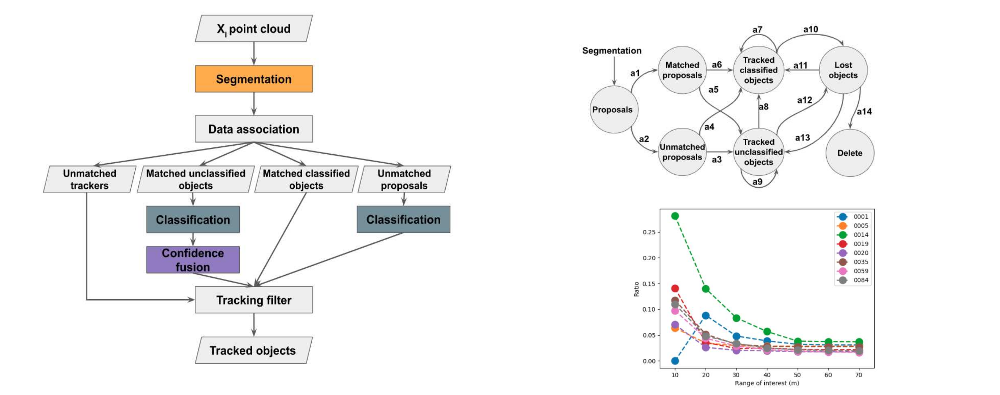
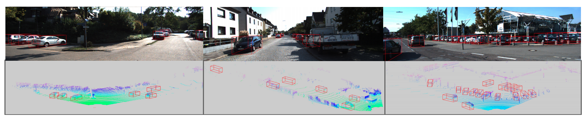
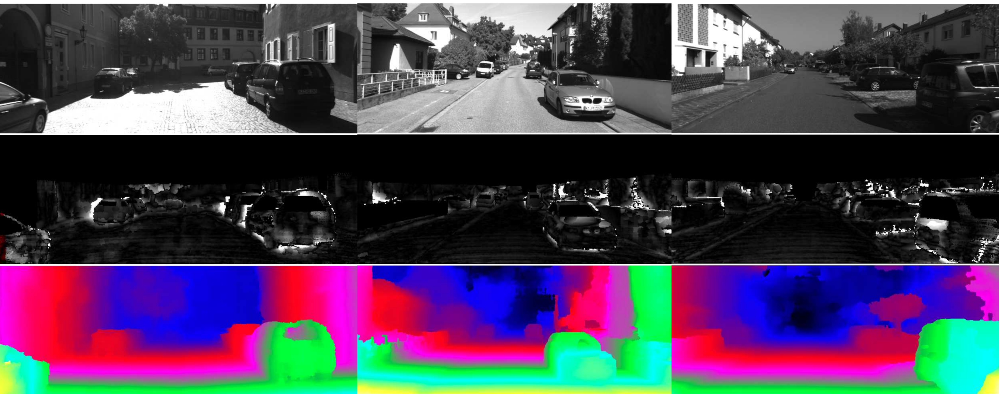

I was a Ph.D. student in [Mechatronic Engineering](https://www.engineering.unsw.edu.au/study-with-us/undergraduate-degrees/mechatronic-engineering) in [University of New South Wales (Sydney)](https://www.unsw.edu.au/) since 2016. My research interest includes computer vision, 3D object detection, SLAM, and robotics. The thesis name is *object detection for intelligent robots in urban contexts*. My Ph.D. advisor is [Dr. Jose Guivant](https://scholar.google.com.au/citations?user=_4IB14IAAAAJ&hl=en). I obtained my bachelor and master degreee from [Wuhan University of Technology](http://english.whut.edu.cn/) in 2013 and 2016.

Research interests:  **Object detection**, **SLAM**, **Optimization**, **Deep learning**, **Stochastic estimation**, **Computer vision**, **Roboitcs**.

E-mail: *xuesong.li@unsw.edu.au*, *benzlee08@gmail.com*, *benzlxs@163.com*  

Related links: [Google Scholar](https://scholar.google.com/citations?user=HIeMGxcAAAAJ) / [Github](https://github.com/Benzlxs) / [Linkedin](https://www.linkedin.com/in/xuesong-li-a0b23516b/)

## Latest news
* *2020-07-18* --- One of my journal papers, *Design and Experimental Validation of Robust Model Predictive Control for the Optimal Trajectory-Tracking of a low-scale autonomous Bulldozer* was submitted to *European Journal of Control*;
* *2020-07-11* --- One of my journal papers, *3D object detection with deep neural network for automatic as-built reconstruction* was under the second review for *Journal of Construction Engineering and Management*;
<!---* *2020-06-28* --- I have submitted my Ph.D. dissertation, named *Object detection for intelligent robots in urban contexts*;--->
* *2020-05-01* --- My journal paper, *[Three-dimensional backbone network for 3D object detection in traffic scenes](https://arxiv.org/abs/1901.08373)* for *IEEE Transportation Systems Magazine*, was under the second review;
* *2020-04-29* --- One of my journal papers, *[Real-time 3D object proposal generation and classification using limited processing resources](https://www.sciencedirect.com/science/article/pii/S0921889020303973)*, was accepted by "Robotics and Autonomous Systems";
* *2020-04-05* --- One journal paper, *[Efficient and accurate object detection with simultaneous classification and tracking](http://arxiv.org/abs/2007.02065)*, was submitted to *IEEE Transactions on Intelligent Transportation Systems* and *arxiv*;

## Research
* [**Real-time 3D object proposal generation and classification using limited processing resources**](https://www.sciencedirect.com/science/article/pii/S0921889020303973), 
   
   **Xuesong Li**, Jose Guivant and Subhan Khan, *Robotics and Autonomous Systems*, 130, 103557. 

* [**Efficient and accurate object detection withsimultaneous classification and tracking**](http://arxiv.org/abs/2007.02065), 
   
   **Xuesong Li** and Jose Guivant. http://arxiv.org/abs/2007.02065, *IEEE Transactions on Intelligent Transportation Systems* (under review), 2020 

* [**Detection of imaged objects with estimated scales**](https://www.scitepress.org/Link.aspx?doi=10.5220/0007353600390047), 
  
   **Xuesong Li**, Ngaiming Kwok, Jose Guivant, etc. *Proceedings of VISAPP*, 5, 39-47, 2019. 
   
    

* [**Three-dimensional backbone network for 3D object detection in traffic scenes**](https://arxiv.org/pdf/1901.08373.pdf), 

   **Xuesong Li**, Jose Guivant, Ngaiming Kwok, etc. https://arxiv.org/pdf/1901.08373.pdf, *IEEE Transportation Systems Magazine* (2nd review) 2019. 

* [**Efficient methods using slanted support windows for slanted surfaces**](https://digital-library.theiet.org/content/journals/10.1049/iet-cvi.2015.0106),

   **Xuesong Li**, Jianguo Liu, Guang Chen, etc.  *IET Computer Vision*, 10, 384-391(7), 2016 

## Teaching
* *Term1 2020*, **Lead Tutor**, [Advanced Autonomous System (MTRN4010)](https://www.handbook.unsw.edu.au/undergraduate/courses/2020/MTRN4010) in University of New South Wales;
* *Term3 2019*, **Lead Tutor**, [Optimisation Methods for Engineering Systems (MTRN4030)](https://www.handbook.unsw.edu.au/undergraduate/courses/2020/MTRN4030) in University of New South Wales; 
* *Term1 2019*, **Guest Lecturer** on Neural network, [Advanced Autonomous System (MTRN4010)](https://www.handbook.unsw.edu.au/undergraduate/courses/2020/MTRN4010) in University of New South Wales;
* *Term1 2018, 2019*, **Tutor**, [Advanced Autonomous System (MTRN4010)](https://www.handbook.unsw.edu.au/undergraduate/courses/2020/MTRN4010) in University of New South Wales;
* *Term2 2018*, **Tutor**, [Optimisation Methods for Engineering Systems (MTRN4030)](https://www.handbook.unsw.edu.au/undergraduate/courses/2020/MTRN4030) in University of New South Wales; 

## Blogs
* *2020-12-04* [Systmatic knowledge on automated system](./blogs/)

